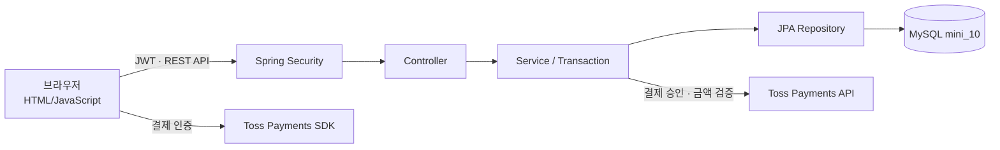
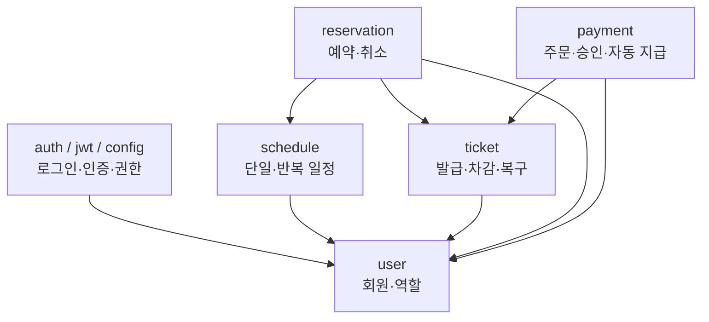
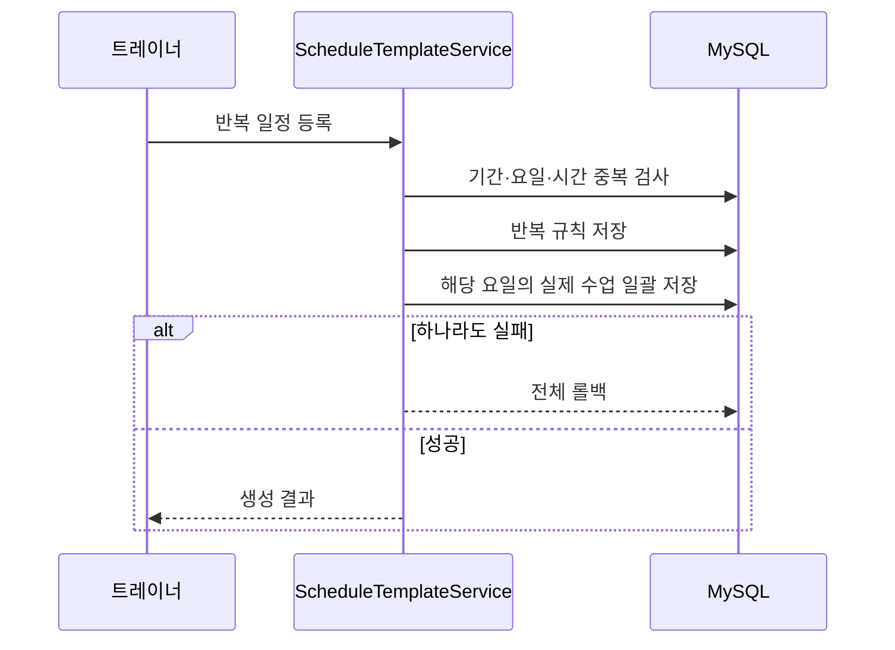
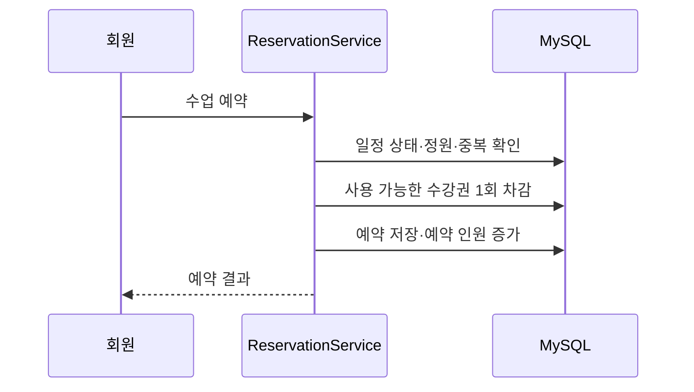
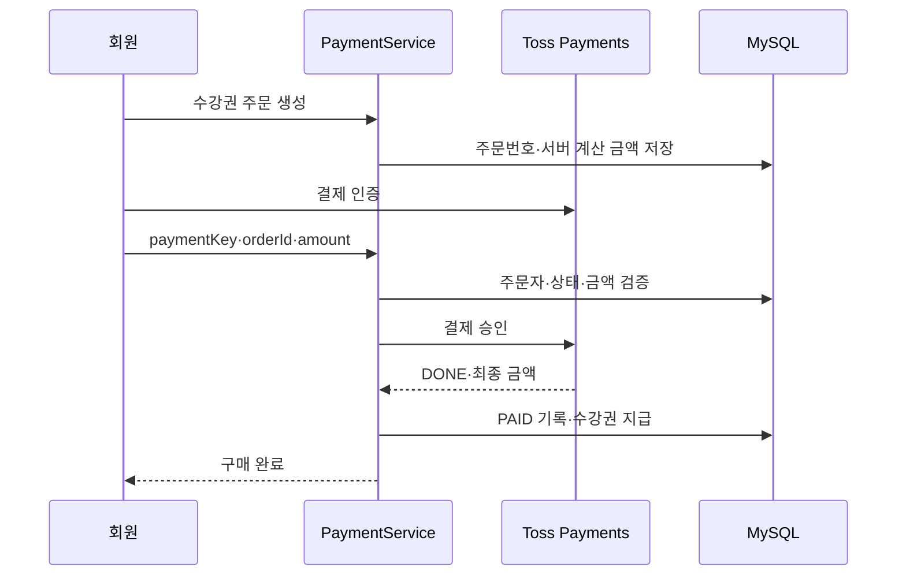

# 시스템 아키텍처

## 전체 구조

## 백엔드 계층

## 권한 모델

| 역할 | 주요 권한 |
|---|---|
| CUSTOMER | 수업 조회, 예약·취소, 내 수강권 조회, 수강권 결제 |
| TRAINER | 본인 일정 및 반복 일정 생성·조회·취소·복원 |
| ADMIN | 회원 목록 조회, 수강권 수동 발급 |

JWT는 `X-AUTH-TOKEN` 헤더로 전달됩니다. 화면의 권한 확인은 편의 기능이며 최종 권한 검사는 Spring Security와 서비스의 소유권 검사에서 수행합니다.

## 핵심 트랜잭션

### 반복 일정 생성

### 예약

### 결제

