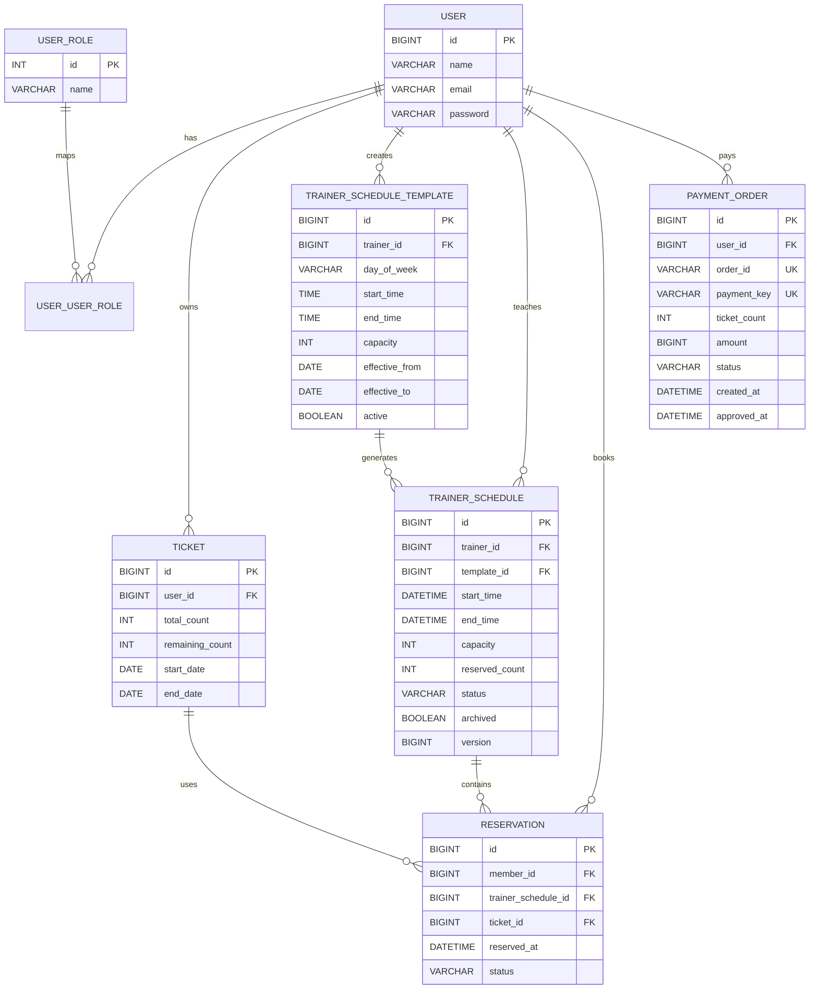

# ERD 및 스키마

## 주요 무결성 규칙

- 사용자와 역할은 `user_user_role` 다대다 매핑으로 연결합니다.
- 회원과 수업의 예약 조합은 유니크하여 중복 예약을 방지합니다.
- 반복 일정 ID와 실제 시작·종료 시각 조합은 유니크하여 같은 수업의 중복 생성을 방지합니다.
- 결제 `order_id`, `payment_key`는 유니크하여 중복 승인·지급을 방지합니다.
- 트레이너 일정의 `version`은 낙관적 락을 위한 필드입니다.
- 예약 이력이 있는 취소 일정은 `archived=true`로 보존하고 화면에서 숨깁니다.

## 샘플 데이터 정책

`DataInitializer`가 역할과 샘플 사용자 이메일을 먼저 조회하고 없는 데이터만 생성합니다. 따라서 서버를 반복 실행해도 같은 샘플 계정이 중복 저장되지 않습니다. 수업·예약·결제 데이터는 테스트 시나리오마다 달라지므로 자동 생성하지 않습니다.
